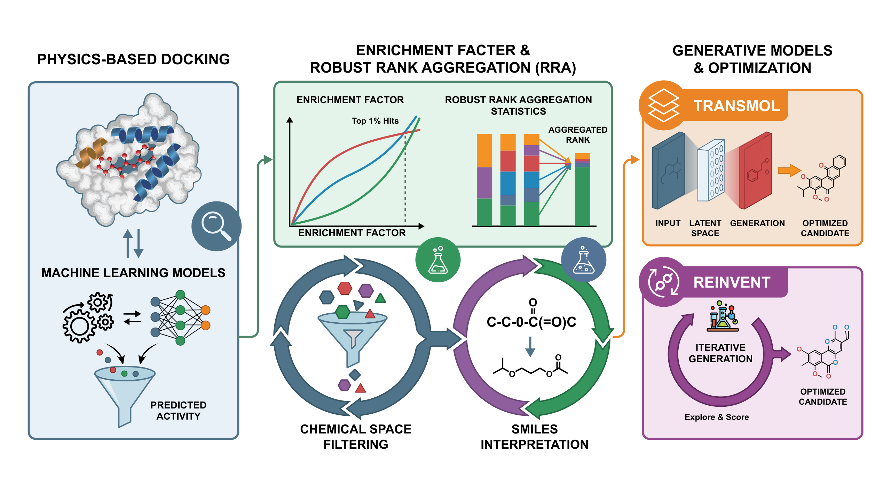

# CWRA: Calibrated Weighted Rank Aggregation for VDR Virtual Screening

[](https://opensource.org/licenses/MIT)
[](https://www.python.org/downloads/)

A framework for combining multiple molecular docking and binding affinity prediction methods to improve virtual screening performance for Vitamin D Receptor (VDR) ligands. Supports 11 modalities including docking scores, deep learning-based affinity predictions, and similarity-based methods.

**Key Results:** CWRA achieves **EF@1% = 24.96** on a dataset of 16,059 compounds (366 actives), placing 91 actives in the top 1% and calcitriol (reference ligand) at rank 29.

## Graphical Abstract

<p align="center">
  
</p>

## Table of Contents

- [Installation](#installation)
- [Quick Start](#quick-start)
- [Project Structure](#project-structure)
- [Usage](#usage)
- [Modalities](#modalities)
- [Performance](#performance)
- [Structure Prediction Pipeline](#structure-prediction-pipeline)
- [Contributing](#contributing)
- [Citation](#citation)
- [License](#license)

## Installation

### From Source

```bash
git clone https://github.com/Salimzhanov/cwra-vdr.git
cd cwra-vdr
pip install -e .
```

### Dependencies

Core dependencies:
- numpy>=1.21.0
- pandas>=1.3.0
- scipy>=1.7.0
- scikit-learn>=1.0.0
- rdkit>=2021.03.1
- matplotlib>=3.5.0

Optional (for structure prediction):
- AutoDock Vina
- Boltz-2 (for AI structure prediction)
- meeko>=0.7.1 (for PDBQT conversion)

## Quick Start

### Command Line

```bash
# Run CWRA with fair weight optimization (recommended)
python cwra_final.py --input data/labeled_raw_modalities.csv --output results/cwra_final --method fair

# Run with specific weight constraints
python cwra_final.py --input data/labeled_raw_modalities.csv --method fair --min-weight 0.03 --max-weight 0.25
```

### Python API

```python
import pandas as pd
from cwra_final import CWRAConfig, CWRAOptimizer

# Load data
df = pd.read_csv('data/labeled_raw_modalities.csv')

# Configure and run CWRA
config = CWRAConfig(method='fair', min_weight=0.03, max_weight=0.25)
optimizer = CWRAOptimizer(config)
results = optimizer.fit(df)

# Get rankings
rankings = results['rankings']
print(f"Top compound: {rankings.iloc[0]['smiles']}")
```

## Project Structure

```
cwra-vdr/
├── cwra_final.py                  # Main CWRA algorithm
├── cwra/                          # Core package (legacy API)
│   ├── __init__.py
│   ├── __main__.py
│   └── cwra.py
├── scripts/                       # Utility scripts
│   ├── generate_g_group_pdbs.py   # Generate docked PDB structures
│   ├── run_boltz2_predictions.py  # Boltz-2 structure predictions
│   ├── compute_*.py               # Modality computation scripts
│   └── run_*.py                   # Inference scripts
├── data/
│   ├── labeled_raw_modalities.csv # Main dataset with all modalities
│   └── composed_modalities.csv    # Extended dataset
├── results/
│   └── cwra_final/                # Final results
│       ├── cwra_final_rankings.csv    # Complete rankings (16,059 compounds)
│       ├── g_group_pdbs_docked/       # Docked PDB structures
│       └── boltz2_predictions/        # Boltz-2 AI structure predictions
├── pdb/                           # VDR structure files
│   ├── 1DB1.pdb                   # VDR crystal structure
│   └── 1DB1.pdbqt                 # AutoDock format
├── models/                        # Pre-trained model weights
├── DrugBAN/                       # DrugBAN submodule
├── MolTrans/                      # MolTrans submodule
├── TankBind/                      # TankBind submodule
├── pyproject.toml
├── requirements.txt
├── README.md
├── CONTRIBUTING.md
├── CHANGELOG.md
└── LICENSE.txt
```

## Modalities

| Modality | Description | Source |
|----------|-------------|--------|
| GraphDTA-Kd | Graph neural network predicting dissociation constants from molecular graphs and protein sequences | [GitHub](https://github.com/thinng/GraphDTA)  |
| GraphDTA-Ki | Graph neural network predicting inhibition constants | [GitHub](https://github.com/thinng/GraphDTA)  |
| GraphDTA-IC50 | Graph neural network predicting half-maximal inhibitory concentrations | [GitHub](https://github.com/thinng/GraphDTA)  |
| MLT-LE pKd | Multi-task residual neural network for binding affinity prediction across pKd, pKi, pIC50 tasks | [GitHub](https://github.com/VeaLi/MLT-LE) |
| AutoDock Vina | Physics-based docking scoring function | [AutoDock Vina](https://vina.scripps.edu/)  |
| Boltz-2 affinity | Foundation model for biomolecular structure and binding affinity prediction | [GitHub](https://github.com/jwohlwend/boltz)  |
| Boltz-2 confidence | Binding likelihood score from Boltz-2 | [GitHub](https://github.com/jwohlwend/boltz) |
| Uni-Mol similarity | 3D molecular representation learning framework; similarity to reference actives | [GitHub](https://github.com/deepmodeling/Uni-Mol) |
| TankBind affinity | Trigonometry-aware neural network for binding structure and affinity prediction | [GitHub](https://github.com/luwei0917/TankBind)  |
| DrugBAN affinity | Bilinear attention network learning pairwise interactions from 2D molecular graphs and protein sequences | [GitHub](https://github.com/peizhenbai/DrugBAN)  |
| MolTrans affinity | Transformer using frequent consecutive subsequence mining for drug-target interaction prediction | [GitHub](https://github.com/kexinhuang12345/MolTrans)  |

## Performance

Results from CWRA fair-weight optimization on 16,059 compounds (366 actives from initial_370 + calcitriol).

### Enrichment Metrics

| Metric | Value | Description |
|--------|-------|-------------|
| **EF@1%** | **24.96** | 91 actives in top 160 compounds |
| **EF@5%** | **13.57** | 248 actives in top 802 compounds |
| **EF@10%** | **9.68** | 354 actives in top 1,605 compounds |
| **Hits@20%** | 362/366 | 98.9% of actives recovered |
| **Hits@30%** | 366/366 | 100% recovery |
| **Calcitriol Rank** | 29 | Reference ligand in top 0.2% |

### Top 50 Compound Composition

| Source | Count | Description |
|--------|-------|-------------|
| initial_370 | 31 | Known VDR binders |
| G2 | 16 | 2-model consensus candidates |
| G3 | 2 | 3-model consensus candidates |
| calcitriol | 1 | Reference ligand (rank 29) |

### Generator Performance in Top 100

The CWRA ranking successfully prioritizes high-quality generated compounds:
- **61** known actives (reference)
- **17** from gmdldr_reinvent (G2)
- **8** from transmol-reinvent-gmdldr (G3)
- **7** from reinvent_transmol (G2)
- **6** from gmdldr_transmol (G2)

## Usage

### Command Line Arguments (cwra_final.py)

| Argument | Default | Description |
|----------|---------|-------------|
| `--input` | required | Input CSV with modalities + SMILES + source |
| `--output` | `results/` | Output directory for results |
| `--method` | `fair` | Optimization: 'fair', 'unconstrained', 'entropy', 'topk' |
| `--min-weight` | `0.03` | Minimum weight per modality (fair method) |
| `--max-weight` | `0.25` | Maximum weight per modality (fair method) |
| `--de-maxiter` | `500` | Differential evolution iterations |
| `--seed` | `42` | Random seed |

### Input Format

The input CSV requires:
- `smiles`: SMILES strings
- `source`: Source identifier (e.g., 'initial_370' for actives, 'G1'/'G2'/'G3' for generated)
- `generator`: Generator name (e.g., 'reinvent', 'gmdldr', 'transmol')
- Modality columns: `graphdta_kd`, `graphdta_ki`, `graphdta_ic50`, `mltle_pKd`, `vina_score`, `boltz_affinity`, `boltz_confidence`, `unimol_similarity`, `tankbind_affinity`, `drugban_affinity`, `moltrans_affinity`

### Output Files

- `cwra_final_rankings.csv`: Complete ranking with CWRA scores (16,059 compounds)
- `g_group_pdbs_docked/`: Docked 3D structures for top/bottom G-group compounds
- `boltz2_predictions/`: AI-predicted protein-ligand complex structures

## Structure Prediction Pipeline

The project includes a complete pipeline for generating 3D structures of top-ranked compounds:

### 1. Generate Docked PDB Structures

```bash
python scripts/generate_g_group_pdbs.py \
    --input results/cwra_final/cwra_final_rankings.csv \
    --output results/cwra_final/g_group_pdbs_docked \
    --receptor pdb/1DB1.pdb \
    --top-n 5 --bottom-n 5 \
    --exhaustiveness 8
```

This generates AutoDock Vina docked structures for top/bottom compounds across G-groups (G1, G2, G3).

### 2. Run Boltz-2 AI Structure Predictions

```bash
python scripts/run_boltz2_predictions.py \
    --manifest results/cwra_final/g_group_pdbs_docked/manifest.csv \
    --output results/cwra_final/boltz2_predictions \
    --accelerator gpu \
    --sampling-steps 200 \
    --diffusion-samples 1
```

Features:
- Uses VDR ligand-binding domain sequence (residues 120-423)
- Generates protein-ligand complex structures via diffusion
- Outputs PDB files with confidence scores (pLDDT, PAE, PDE)
- Uses ColabFold MSA server for sequence alignment

### Output Structure

```
results/cwra_final/
├── cwra_final_rankings.csv        # CWRA rankings for all compounds
├── g_group_pdbs_docked/           # Docked structures
│   ├── manifest.csv               # Compound metadata
│   ├── top_G1_rank00137_*.pdb
│   └── ...
└── boltz2_predictions/            # Boltz-2 predictions
    ├── boltz2_results.csv         # Summary with confidence scores
    ├── boltz_results_*/           # Per-compound results
    │   └── predictions/
    │       └── *_model_0.pdb      # Predicted structure
    └── inputs/                    # YAML input files
```

## Reproducing publication figures

Regenerate `results/publication_figures/fig1..fig7_*.pdf` (and PNGs) from an existing CWRA run:

```bash
python scripts/generate_publication_figures.py --prefix results/extended --outdir results/publication_figures
```

Notes:
- The script will reuse `results/plip_analysis.(pdf|png)` if present.
- To regenerate from a different run, pass its prefix (e.g. `results/extended_cv`).

## Metrics

- **EF@k%**: Enrichment Factor at k% of database
- **Hits@k**: Number of actives in top k compounds
- **BEDROC**: Boltzmann-Enhanced Discrimination of ROC

## Contributing

See [CONTRIBUTING.md](CONTRIBUTING.md) for guidelines.

## Authors

- **Abylay Salimzhanov** — [ORCID](https://orcid.org/0000-0001-6630-585X)
- **Ferdinand Molnár** — [ORCID](https://orcid.org/0000-0001-9008-4233)
- **Siamac Fazli** — [ORCID](https://orcid.org/0000-0003-3397-0647)

## Citation

```bibtex
@software{salimzhanov2026cwra,
  title={CWRA: Calibrated Weighted Rank Aggregation for VDR Virtual Screening},
  author={Salimzhanov, Abylay and Moln{\'a}r, Ferdinand and Fazli, Siamac},
  year={2026},
  url={https://github.com/Salimzhanov/cwra-vdr},
  version={1.3.0}
}
```

## License

MIT License — see [LICENSE](LICENSE.txt).
