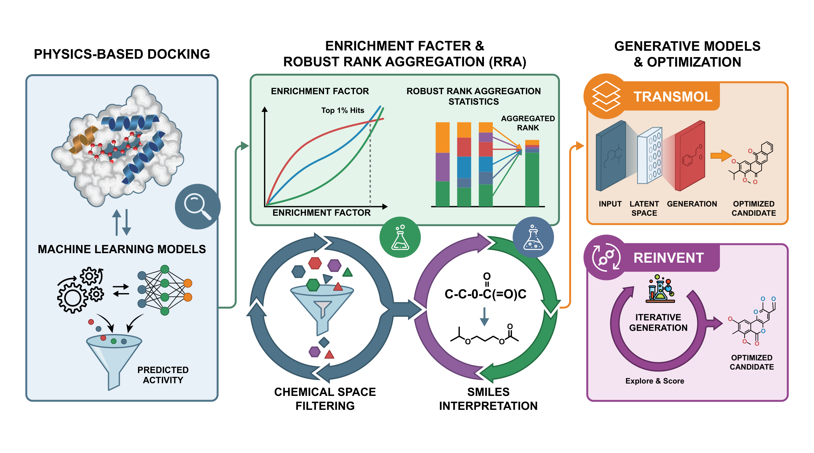

# CWRA: Calibrated Weighted Rank Aggregation for VDR Virtual Screening

[](https://opensource.org/licenses/MIT)
[](https://www.python.org/downloads/)
[](https://github.com/Salimzhanov/cwra-vdr/actions/workflows/ci.yml)

A framework for combining multiple molecular docking and binding affinity prediction methods to improve virtual screening performance for Vitamin D Receptor (VDR) ligands. Supports 11 modalities including docking scores, deep learning-based affinity predictions, and similarity-based methods.

**Key Results:** CWRA achieves **EF@1% = 24.96** on a dataset of 16,059 compounds (366 actives), placing 91 actives in the top 1% and calcitriol (reference ligand) at rank 29.

## Graphical Abstract

<p align="center">
  
</p>

## Table of Contents

- [Installation](#installation)
- [Reproduce Paper Results](#reproduce-paper-results)
- [Project Structure](#project-structure)
- [Modalities](#modalities)
- [Performance](#performance)
- [Structure Prediction Pipeline](#structure-prediction-pipeline)
- [Contributing](#contributing)
- [Citation](#citation)
- [License](#license)

## Installation

```bash
git clone https://github.com/Salimzhanov/cwra-vdr.git
cd cwra-vdr
python -m venv .venv
# Linux/macOS: source .venv/bin/activate
# Windows:     .venv\Scripts\activate
pip install -r requirements.txt
```

Editable install (also makes the `cwra` console command available):

```bash
pip install -e .
```

### Core Dependencies

- numpy ≥ 1.21 · pandas ≥ 1.3 · scipy ≥ 1.7 · scikit-learn ≥ 1.0
- rdkit ≥ 2021.03 · matplotlib ≥ 3.5 · tqdm ≥ 4.60

### Optional (structure prediction)

- AutoDock Vina
- Boltz-2 (for AI structure prediction)
- meeko ≥ 0.7.1 (for PDBQT conversion)

## Reproduce Paper Results

The single command below runs the full paper pipeline end-to-end:

```bash
python run_cwra.py
```

This executes, in order:

1. **CWRA cross-validation** — `cwra.py` (weight optimization, enrichment metrics)
2. **LaTeX tables** — `create_cwra_tables.py`
3. **PU-conformal selection** — `pu_conformal.py`
4. **Molecule panel** — `make_mol_panel.py`
5. **Publication figures** — `plot_results/01_data_pipeline.py`, `plot_results/plot_cwra_stats.py`

To inspect each command without running:

```bash
python run_cwra.py --dry-run
```

### Individual Steps

```bash
# 1. CWRA cross-validation (main algorithm)
python cwra.py \
  -i data/composed_modalities_with_rdkit.csv \
  -o results/final \
  --method fair --norm minmax --objective default \
  --bedroc --bedroc-alpha 100 --max-mw 700 \
  --train-frac 0.85 --cv-folds 5 --seed 42 \
  --de-workers -1 --include-newref-137-as-active \
  --fold-honest-unimol --unimol-embeddings data/unimol_embeddings.npz \
  --extra-metrics

# 2. Export LaTeX tables
python create_cwra_tables.py --results-dir results/final

# 3. PU-conformal compound selection
python pu_conformal.py \
  --input data/composed_modalities_with_rdkit.csv \
  --outdir results/final/pipeline \
  --score-source cwra \
  --cwra-weights-csv results/final/cwra_cv_mean_weights.csv \
  --cwra-norm minmax \
  --include-newref-137-as-active --seed 42 \
  --max-mw 700 --max-rotb 15 --pval-type unweighted

# 4. Molecule panel figure
python make_mol_panel.py \
  --csv results/final/pipeline/E/final_selected.csv \
  --out results/final/panel_10x5.pdf \
  --n 50 --per-row 5 --cell 320 --sort meta --tau 0.001
```

### Environment Smoke Test

```bash
python scripts/smoke_check.py
```

See also [docs/GITHUB_QUICKSTART.md](docs/GITHUB_QUICKSTART.md) for a step-by-step walkthrough.

## Project Structure

```
cwra-vdr/
├── cwra.py                        # Main CWRA algorithm (CV, optimization, metrics)
├── pu_conformal.py                # PU-conformal compound selection pipeline
├── run_cwra.py                    # Orchestrator — runs full paper pipeline
├── create_cwra_tables.py          # Export LaTeX performance tables
├── make_mol_panel.py              # Molecule grid figures
├── cwra/                          # Python package (pip install -e .)
│   ├── __init__.py                #   Re-exports from cwra.py
│   └── __main__.py                #   python -m cwra entry point
├── scripts/                       # Utility & computation scripts
│   ├── smoke_check.py             #   Environment validation
│   ├── run_vina_docking.py        #   AutoDock Vina docking
│   ├── run_boltz2_top100.py       #   Boltz-2 structure predictions
│   ├── generate_top100_g_pdbs.py  #   Generate docked PDB structures
│   └── compute_*.py               #   Modality computation scripts
├── plot_results/                   # Publication figure generation
│   ├── 01_data_pipeline.py
│   ├── 02_generate_figures.py
│   └── 03_generate_html_report.py
├── data/
│   ├── README.md                  # Data provenance & schema documentation
│   ├── composed_modalities_with_rdkit.csv   # Main dataset (11 modalities)
│   ├── labeled_raw_modalities.csv
│   └── unimol_embeddings.npz
├── results/                       # Generated outputs (not tracked in git)
├── pdb/                           # VDR structure files (1DB1 crystal structure)
├── models/                        # Pre-trained model weights
├── DrugBAN/                       # DrugBAN submodule
├── MolTrans/                      # MolTrans submodule
├── TankBind/                      # TankBind submodule
├── tests/                         # Unit tests
├── pyproject.toml
├── requirements.txt
├── CONTRIBUTING.md
├── CITATION.cff
├── RELEASE.md
└── LICENSE.txt
```

## Modalities

| Modality | Description | Source |
|----------|-------------|--------|
| GraphDTA-Kd | Graph neural network predicting dissociation constants | [GitHub](https://github.com/thinng/GraphDTA) |
| GraphDTA-Ki | Graph neural network predicting inhibition constants | [GitHub](https://github.com/thinng/GraphDTA) |
| GraphDTA-IC50 | Graph neural network predicting half-maximal inhibitory concentrations | [GitHub](https://github.com/thinng/GraphDTA) |
| MLT-LE pKd | Multi-task residual neural network for binding affinity prediction | [GitHub](https://github.com/VeaLi/MLT-LE) |
| AutoDock Vina | Physics-based docking scoring function | [AutoDock Vina](https://vina.scripps.edu/) |
| Boltz-2 affinity | Foundation model for biomolecular binding affinity prediction | [GitHub](https://github.com/jwohlwend/boltz) |
| Boltz-2 confidence | Binding likelihood score from Boltz-2 | [GitHub](https://github.com/jwohlwend/boltz) |
| Uni-Mol similarity | 3D molecular representation similarity to reference actives | [GitHub](https://github.com/deepmodeling/Uni-Mol) |
| TankBind affinity | Trigonometry-aware neural network for binding affinity | [GitHub](https://github.com/luwei0917/TankBind) |
| DrugBAN affinity | Bilinear attention network for drug–target interaction | [GitHub](https://github.com/peizhenbai/DrugBAN) |
| MolTrans affinity | Transformer for drug–target interaction prediction | [GitHub](https://github.com/kexinhuang12345/MolTrans) |

## Performance

Results from CWRA fair-weight optimization on 16,059 compounds (366 actives from initial_370 + calcitriol).

### Enrichment Metrics

| Metric | Value | Description |
|--------|-------|-------------|
| **EF@1%** | **24.96** | 91 actives in top 160 compounds |
| **EF@5%** | **13.57** | 248 actives in top 802 compounds |
| **EF@10%** | **9.68** | 354 actives in top 1,605 compounds |
| **Hits@20%** | 362/366 | 98.9% of actives recovered |
| **Hits@30%** | 366/366 | 100% recovery |
| **Calcitriol Rank** | 29 | Reference ligand in top 0.2% |

### Top 50 Compound Composition

| Source | Count | Description |
|--------|-------|-------------|
| initial_370 | 31 | Known VDR binders |
| G2 | 16 | 2-model consensus candidates |
| G3 | 2 | 3-model consensus candidates |
| calcitriol | 1 | Reference ligand (rank 29) |

## Structure Prediction Pipeline

The project includes pipelines for generating 3D structures of top-ranked compounds.

### AutoDock Vina Docking

```bash
python scripts/run_vina_docking.py --timeout 1800
```

### Boltz-2 AI Structure Predictions

```bash
python scripts/run_boltz2_top100.py --accelerator gpu --sampling-steps 200
```

Features:
- Uses VDR ligand-binding domain sequence (residues 120–423)
- Generates protein–ligand complex structures via diffusion
- Outputs PDB files with confidence scores (pLDDT, PAE, PDE)

## Input Format

The input CSV requires:
- `smiles`: SMILES strings
- `source`: Source identifier (e.g., `initial_370` for actives, `G1`/`G2`/`G3` for generated)
- `generator`: Generator name (e.g., `reinvent`, `gmdldr`, `transmol`)
- Modality columns: `graphdta_kd`, `graphdta_ki`, `graphdta_ic50`, `mltle_pKd`, `vina_score`, `boltz_affinity`, `boltz_confidence`, `unimol_similarity`, `tankbind_affinity`, `drugban_affinity`, `moltrans_affinity`

## Metrics

- **EF@k%**: Enrichment Factor at k% of database
- **Hits@k**: Number of actives in top k compounds
- **BEDROC**: Boltzmann-Enhanced Discrimination of ROC

## Contributing

See [CONTRIBUTING.md](CONTRIBUTING.md) for guidelines.

## Authors

- **Abylay Salimzhanov** — [ORCID](https://orcid.org/0000-0001-6630-585X)
- **Ferdinand Molnár** — [ORCID](https://orcid.org/0000-0001-9008-4233)
- **Siamac Fazli** — [ORCID](https://orcid.org/0000-0003-3397-0647)

## Citation

If you use this code in your research, please cite:

```bibtex
@software{salimzhanov2026cwra,
  title   = {CWRA: Calibrated Weighted Rank Aggregation for VDR Virtual Screening},
  author  = {Salimzhanov, Abylay and Moln{\'a}r, Ferdinand and Fazli, Siamac},
  year    = {2026},
  url     = {https://github.com/Salimzhanov/cwra-vdr},
  version = {1.3.0}
}
```

## License

MIT License — see [LICENSE.txt](LICENSE.txt).
